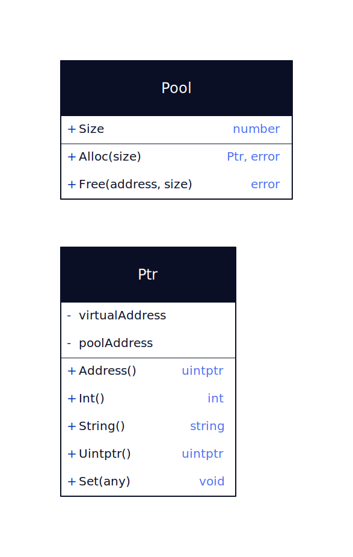

# Goumem - Manual Memory Allocation Library

Who said Go doesn't have manual memory allocation?

**NO NEED TO CALL C** and context switch to manually allocate memory.

Goumem is a library that provides manual memory allocation functions for Go,
the way C does it, by using `mmap` for unix systems or the `KERNEL32 - VirtualAlloc` for windows systems.

## Supports

- Unix & POSIX compliant systems (Linux, macOS, ...)
- Windows

## Installation

```bash
go get github.com/exapsy/goumem
```

## Why

**Golang** has **Garbage Collector**.

This, is not inherently bad. Quite the opposite! A garbage collector saves you from the effort of

- Tracking objects
- Deallocating objects
- Many memory leaks (memory leaks always can happen, but now it's very-very difficult!)
- Batch de-allocation
- Strategic colored de-allocations
- Means MUCH less CPU calling for free-ing objects which is VERY time consuming
- Very confusing bugs
- Leaks!!!!

But, what a garbage collector doesn't do, is allocating and deallocating at will.
Sometimes, this is quite important, as you know that "hey, I won't be needing this batch of memory anymore and it takes MUCH memory,
and they're already many objects for GC to track, so I would like to deallocate them myself".

In general, all these good things that I mentioned about GC, come at a cost. CPU and Memory.

- When you allocate an object with GC, you essentially say "Hey, GC, keep track of this object"
- When you want to de-allocate it, you simply can't. And that may be a good thing when you don't batch-deallocate, like with memory arenas or pools, but when you actually do have memory pools and you know what you're doing, and you need that extra juice, GC just doesn't give it to you. It will simply track these objects to their literal death. Which, if you're working on very performing tasks, or on very small machines with very little memory or CPU process, may be very crucial! 

In general, Garbage Collection is not bad. I've heard that argument quite a lot of times because of all the clout around "manual memory management good but unsafe, GC bad but safe", when it couldn't be further from the truth.

But, GC comes at a good cost when you actually have different needs. Memory batching for de-allocation is nice, but if I already know this is quite a big batch and I don't have so much memory, and I don't have such a good processor or I want to keep track of a million objects either, I would probably like to have some control over how I allocate and de-allocate memory.

Remember, manual memory management is not good by itself. It's only good if you know how to use good patterns. Otherwise, a very simple GC will be MUCH better at benchmarks than your "manual memory management".

That's why we implement Memory arenas, pools and batching. Because we don't wanna call the CPU so many times. The distance between the CPU nd the memory and back to context switch to your program is like going from the moon to the sun and back, in computer terms. You don't want just to have manual memory allocation. You want to know WHEN to manually memory allocate, and when to use mutexes because they cost a lot to memory allocate as well, when to use GC instead because it may come at less cost both in maintenance and cost maybe.

That's it. Neither is good or bad. Both have their extremely good usecases, and even worse, manual memory allocation has many caveats and you have to know what you're doing and why. So, use with care, and always Free(obj)!


## Benchmark

Admittedly, the benchmark was run on purpose while I was running Chrome behind with a youtube video because I know it takes quite a lot of CPU processing and RAM. It's the purpose of this benchmark to show the contrast between the custom memory allocation versus garbage collection for this specific benchmark that I used it for.

It's a benchmark over pool of:

```go
const (
    numMatrices = 100000
    rows        = 100
    cols        = 100
)
```

**Results**

```
 go test -bench=. -benchmem -benchtime=60s
goos: linux
goarch: amd64
pkg: github.com/exapsy/goumem
cpu: 12th Gen Intel(R) Core(TM) i7-1255U
BenchmarkMatrix64PoolCustomMemory-12               3        25552590662 ns/op        1335242 B/op      33334 allocs/op
BenchmarkMatrix64PoolGCMemory-12                   1        61972287972 ns/op       9231215384 B/op 10100147 allocs/op
PASS
ok      github.com/exapsy/goumem        214.718s
```

## Example - Create a pool



```go
package main

import (
    "fmt"
    "github.com/exapsy/goumem"
)

func main() {
    pool, err := goumem.NewPool(goumem.PoolOptions{
        // Size of the goumem in bytes 
        Size: 15,
    })
    if err != nil {
        panic(fmt.Errorf("New() error = %v", err))
    }

    // Allocate 2 times 4 bytes (8 bytes total)
    addr, err := pool.Alloc(4)
    if err != nil {
        panic(fmt.Errorf("Alloc() error = %v", err))
    }

    addr.Set(456)
    if addr.Int() != 456 {
        panic(fmt.Errorf("Alloc() = %v, want 456", addr.Int()))
    }

    addr2, err := pool.Alloc(4)
    if err != nil {
        panic(fmt.Errorf("Alloc() error = %v", err))
    }

    addr2.Set(456)
    if addr2.Int() != 456 {
        panic(fmt.Errorf("Alloc() = %v, want 456", addr2.Int()))
    }

    // Free the first 4 bytes
    err = pool.Free(addr, 4)
    if err != nil {
        panic(fmt.Errorf("Free() error = %v", err))
    }

    // Allocate 4 bytes again (should work since we freed 4 bytes)
    addr3, err := pool.Alloc(4)
    if err != nil {
        panic(fmt.Errorf("Alloc() error = %v", err))
    }

    addr3.Set(456)
    if addr3.Int() != 456 {
        panic(fmt.Errorf("Alloc() = %v, want 456", addr3.Int()))
    }

    // Free the goumem
    err = pool.Close()
    if err != nil {
        panic(fmt.Errorf("Free() error = %v", err))
    }
}

```

## Example - Arena Pools

```go
package main

import (
    "fmt"
    "github.com/exapsy/goumem"
)

func main() {
    var err error

    opts := goumem.ArenaPoolOptions{
        NumArenas: 2,    // 2 arenas
        ArenaSize: 1000, // 1000 bytes
    }

    ap, err := goumem.NewArenaPool(opts)

    arena := ap.Get()
    v, err := arena.Alloc(10)
    if err != nil {
        panic(fmt.Errorf("Alloc() error = %v", err))
    }
    v.Set(123)
    fmt.Println(v.Int())
    err = arena.Free(v, 10)
    if err != nil {
        panic(fmt.Errorf("Free() error = %v", err))
    }

    ap.ReturnArena(arena)

    err = ap.Close()
    if err != nil {
        panic(fmt.Errorf("Close() error = %v", err))
    }

```
